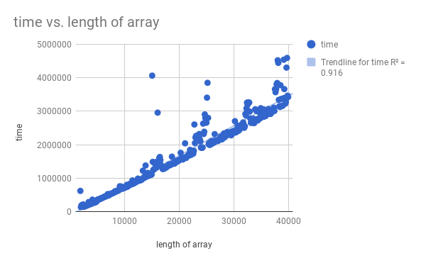
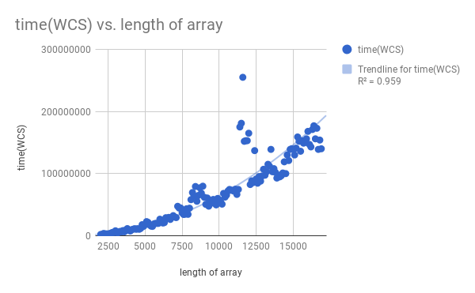

# Team_Jokes
James Huang, Shafali Gupta, Kevin Feng

**Hypothesis**
For QuickSort, we think that in the majority of situations(aka a random, unsorted list of numbers), the runtime will be close to O(n)

